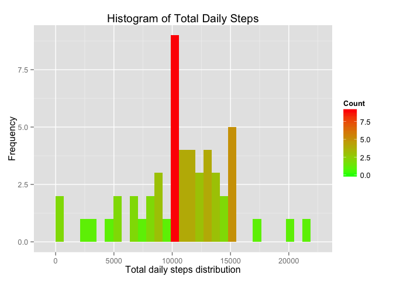
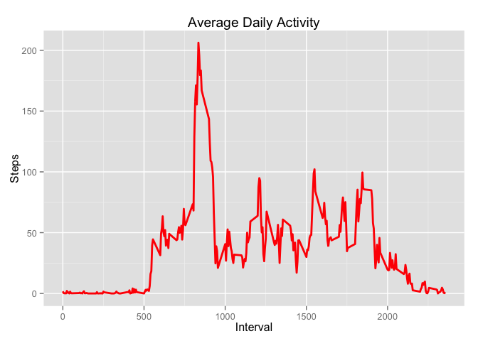
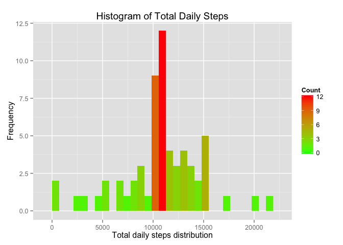
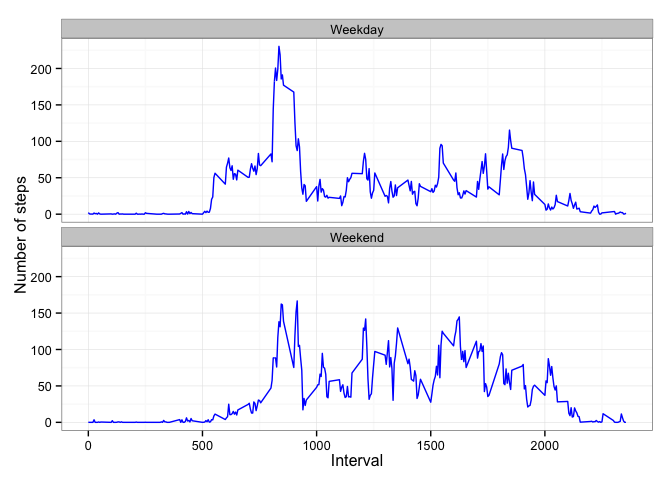

# Reproducible Research: Peer Assessment 1
Hirley Dayan  
May 16, 2015  

###Loading and preprocessing the data

For performing the analysis presented in this report, the data can be download 
from [here](https://d396qusza40orc.cloudfront.net/repdata%2Fdata%2Factivity.zip).

Initially, all the needed libraries are loaded using the lines:


```r
library(data.table)
library(plyr)
library(ggplot2)
```

The following lines automatically download the file into the working directory, 
unzip it and delete the zip file for keeping the working directory clean.


```r
file.src = "https://d396qusza40orc.cloudfront.net/repdata%2Fdata%2Factivity.zip"
file.zip = "repdata_data_activity.zip"
dwmethod = "curl"
download.file(url = file.src, destfile = file.zip, method = dwmethod)
unzip(file.zip)
file.remove(file.zip)
```

```
## [1] TRUE
```

The unzipped file, which is in the csv file, is read with the commands in the next 
lines.


```r
file.csv = "activity.csv"
activity.dt <- data.table(read.csv(file.csv))
```

The variable data is formated accordingly using the following code line:


```r
activity.dt$date <- as.Date(activity.dt$date, format = "%Y-%m-%d")
```

A short printout of the loaded dataset is shown following:


```r
head(activity.dt)
```

```
##    steps       date interval
## 1:    NA 2012-10-01        0
## 2:    NA 2012-10-01        5
## 3:    NA 2012-10-01       10
## 4:    NA 2012-10-01       15
## 5:    NA 2012-10-01       20
## 6:    NA 2012-10-01       25
```

The commands following cleans the dataset removing any NA entries, creating 
a new dataset without missing values.


```r
activity.dt.clean <- activity.dt[!is.na(activity.dt$steps)]
head(activity.dt.clean)
```

```
##    steps       date interval
## 1:     0 2012-10-02        0
## 2:     0 2012-10-02        5
## 3:     0 2012-10-02       10
## 4:     0 2012-10-02       15
## 5:     0 2012-10-02       20
## 6:     0 2012-10-02       25
```

```r
na.number <- nrow(activity.dt.clean[is.na(activity.dt.clean$steps)])
```

The number of **missing values** in the clean database is **0**.

###What is mean total number of steps taken per day?

The daily total amount of steps is calculated in the next lines.


```r
steps.daily <- aggregate(activity.dt.clean$steps, 
                               by=list(date = activity.dt.clean$date), 
                               FUN=sum)
setnames(steps.daily,"x","steps")
head(steps.daily)
```

```
##         date steps
## 1 2012-10-02   126
## 2 2012-10-03 11352
## 3 2012-10-04 12116
## 4 2012-10-05 13294
## 5 2012-10-06 15420
## 6 2012-10-07 11015
```

The daily total amount of steps is shown by the graph following:


```r
qplot(steps.daily[!is.na(steps.daily$steps),]$steps, 
      xlab = "Total daily steps distribution",
      ylab = "Frequency",
      main = "Histogram of Total Daily Steps") +
        geom_histogram(aes(fill = ..count..)) +
        scale_fill_gradient("Count", low = "green", high = "red")
```

```
## stat_bin: binwidth defaulted to range/30. Use 'binwidth = x' to adjust this.
## stat_bin: binwidth defaulted to range/30. Use 'binwidth = x' to adjust this.
```

 

The daily mean and median amounts of steps are shown in the next lines.


```r
steps.mean <- mean(steps.daily$steps)
steps.median <- median(steps.daily$steps)
```

The mean is **10766.19** and the median is 
**10765**.

###What is the average daily activity pattern?

The average daily activity pattern is shown in the graph following:


```r
steps.interval.mean <- aggregate(activity.dt.clean$steps, 
                                by = list(interval = activity.dt.clean$interval),
                                FUN=mean)
setnames(steps.interval.mean,"x", "steps")
ggplot(data=steps.interval.mean, aes(x=interval, y=steps)) + 
        geom_line(colour="red", size=1) + 
        labs(title="Average Daily Activity", x="Interval", y="Steps")
```

 

###Imputing missing values


```r
na.number <- nrow(activity.dt[is.na(activity.dt$steps)])
```

A number of **2304** entries in the dataset has **missing values**.

For filling the gaps in the dataset, the commands shown in the lines that follows 
replace the NA steps with the mean steps values, in integer, from the equivalent 
interval.


```r
na_replacement.dt <- merge(activity.dt[is.na(activity.dt$steps)],
                           steps.interval.mean,by="interval",
                           , all = TRUE)
na_replacement.dt <- na_replacement.dt[,.(interval = interval,
                                       date = date,
                                       steps = steps.y)]

activity.complete.dt <- merge(activity.dt,
                              na_replacement.dt,
                              by = c("date", "interval"), 
                              all = TRUE)

activity.complete.dt[is.na(activity.complete.dt$steps.x)] <- 
        mutate(activity.complete.dt[is.na(activity.complete.dt$steps.x)],
               steps.x = as.integer(steps.y))

activity.complete.dt <- activity.complete.dt[,.(steps = steps.x,
                                                date = date, 
                                                interval = interval)]
na.number <- nrow(activity.complete.dt[is.na(activity.complete.dt$steps)])
```

The number of **missing values** in the database after the steps above is 
**0**.


```r
head(activity.complete.dt)
```

```
##    steps       date interval
## 1:     1 2012-10-01        0
## 2:     0 2012-10-01        5
## 3:     0 2012-10-01       10
## 4:     0 2012-10-01       15
## 5:     0 2012-10-01       20
## 6:     2 2012-10-01       25
```

The daily total amount of steps, using the adjusted ***missing values*** dataset,
is shown by the graph following:


```r
steps.daily <- aggregate(activity.complete.dt$steps, 
                               by=list(date = activity.complete.dt$date), 
                               FUN=sum)
setnames(steps.daily,"x","steps")
head(steps.daily)
```

```
##         date steps
## 1 2012-10-01 10641
## 2 2012-10-02   126
## 3 2012-10-03 11352
## 4 2012-10-04 12116
## 5 2012-10-05 13294
## 6 2012-10-06 15420
```

```r
qplot(steps.daily[!is.na(steps.daily$steps),]$steps, 
      xlab = "Total daily steps distribution",
      ylab = "Frequency",
      main = "Histogram of Total Daily Steps") +
        geom_histogram(aes(fill = ..count..)) +
        scale_fill_gradient("Count", low = "green", high = "red")
```

```
## stat_bin: binwidth defaulted to range/30. Use 'binwidth = x' to adjust this.
## stat_bin: binwidth defaulted to range/30. Use 'binwidth = x' to adjust this.
```

 

The daily mean and median amounts of steps are shown in the next lines.


```r
steps.mean <- mean(steps.daily$steps)
steps.median <- median(steps.daily$steps)
```

The mean is **10749.77** and the median is 
**10641**.

###Are there differences in activity patterns between weekdays and weekends?

The code lines following calculate the activity patterns during the weekdays 
and weekends.


```r
activity.week.dt <- mutate(activity.complete.dt,
                               weekday = weekdays(activity.complete.dt$date))

weekends <- c("Saturday","Sunday")
weekdays <- c("Monday", "Tuesday", "Wednesday", "Thursday", "Friday")
activity.week.dt[activity.week.dt$weekday %in% weekends]$weekday <- "Weekend"
activity.week.dt[activity.week.dt$weekday %in% weekdays]$weekday <- "Weekday"

activity.week.dt$weekday <- as.factor(activity.week.dt$weekday)

activity.weekend.dt <- activity.week.dt[activity.week.dt$weekday == "Weekend"]
steps.weekend <- aggregate(activity.weekend.dt$steps, 
                               by=list(interval = activity.weekend.dt$interval), 
                               FUN=mean)
steps.weekend$weekday <- "Weekend"
setnames(steps.weekend,"x", "steps")

activity.weekday.dt <- activity.week.dt[activity.week.dt$weekday == "Weekday"]
steps.weekday <- aggregate(activity.weekday.dt$steps, 
                               by=list(interval = activity.weekday.dt$interval), 
                               FUN=mean)
steps.weekday$weekday <- "Weekday"
setnames(steps.weekday,"x", "steps")

steps.week <- rbind(steps.weekday,steps.weekend)
```

The graph following shows the mean number of steps during the analyzed dataset 
period during the weekdays and weekends.


```r
ggplot(steps.week, aes(x=interval, y=steps)) + 
        geom_line(color="blue") + 
        facet_wrap(~ weekday, nrow=2, ncol=1) +
        labs(x="Interval", y="Number of steps") +
        theme_bw()
```

 
